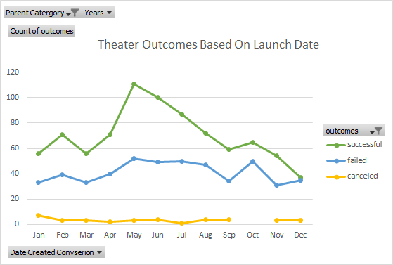
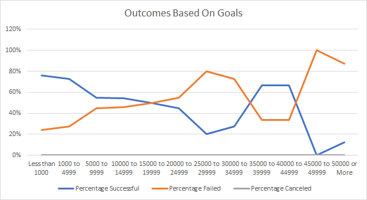

# Kickstarting with Excel

## Overview of Project

### Purpose
The purpose of this assignment was to learn how to extract specific Data Points from a dataset using filters and pivot tables in order to analyze different outcomes. Upon analyzing different outcomes we learned how to visualize it using graphs and charts and present it to Louise to point out patterns and trends under specific conditions. In terms of extracting the data, we learned the importance of formatting in order to make sure the date is clean and presentable and easier to filter and extract. We also learned how to utilize basic functions such as countifs and sum. This was all in order to help Louise have success in planning a campaign.
## Analysis and Challenges

### Analysis of Outcomes Based on Launch Date

-The months of May, June, and July had the highest rate of successful campaigns

-Throughout all the months, more campaigns were successful than failed
### Analysis of Outcomes Based on Goals

-The Goal Ranges in which there were more failed than successful include: 15k-40k and 40k-50k+

-Campaigns with goals less than 5k had the most success rate
### Challenges and Difficulties Encountered
Some things I struggled at first with was having the correct Pivot Table fields, such as "Years" for the Filters and count of "Outcomes". I was also stuck on sorting the rows in descending order. I also found it quite tedious to change each individual COUNTIF formula in Deliverable 2 to account for each Goal Conditional and was not sure if there was an easier way in getting that done.
## Results

- What are two conclusions you can draw about the Outcomes based on Launch Date?
Louise should aim to Launch the campaign in May or June, the months with the most successful campaigns.
October would be the worst time to launch a campaign
- What can you conclude about the Outcomes based on Goals?
Louise should aim to have the goal less than 20k, as Sucessul Campaign Rates begin to dip below Failed Campaign Rates after 20k

- What are some limitations of this dataset?
The "Outcomes based on Launch Date" Chart does not include the Percentages of Successes/Fails 
The dataset does not account for a surplus of donations. It could be useful to know how much of a surplus was raised for successful campaigns.
- What are some other possible tables and/or graphs that we could create?
We could try creating a table that includes the "Average Donation" and "Goal" to see if we can draw any conclusions about how much people donate based on what the goal is.
